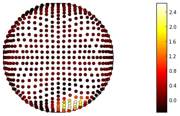

.. _dipy:

Dipy: diffusion imaging in python
----------------------------

`Dipy <http://dipy.org>`_ is a library for the analysis of diffusion MRI
data. Diffusion MRI measures the displacement of water molecules in brain
tissue at a microscopic scale, allowing estimation of the structure of the
tissue and, through algorithms for tractography, estimation of the locations
and trajectories of connections between different parts of the brain. Dipy was
started by `Eleftherios Garyfallidis <http://garyfallidis.github.io/>`_ and is
developed by `several others <https://github.com/nipy/dipy/graphs/contributors>`__.

Below is a visualization of the diffusion signal measured in a single voxel in
the brain and an estimate of the fiber orientation density function associated
with the signal in that location.

.. image:: dipy_vizualisation1.png
   :scale: 80 %
   :target: http://nipy.org/dipy

.. include:: links.txt
