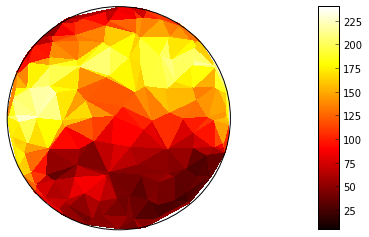

.. _code:

=======================================
 Software Development and Data Sharing
=======================================

As our tools to study the brain become more and more sophisticated, we are
faced with massive amounts of data. Increasingly, scientific research requires
writing software to deal with these growing amounts of data and in order to
apply more sophisticated methods of analysis. However, in order for scientific
results to be reproducible it is essential that we make data available to other
researchers and that we publish the computer code used to generate our
results.

Here are some of my attempts to do that. For more, take a look at my `github
account`__

__ github_

NIPY
====

`Nipy`__ is a community which fosters the collaborative writing of reproducible
research code for neuroimaging in the `Python`__ programming language. I am
currently involved in the development of two libraries within this framework:

__ nipy_
__ whypython_

Dipy
----

`Dipy`__ is a library for the analysis of diffusion MRI data. Diffusion MRI
measures the displacement of water molecules in brain tissue at a microscopic
scale, allowing estimation of the structure of the tissue and, through
algorithms for tractography estimation of the locations and trajectories of
connections between different parts of the brain. Dipy was started by
`Eleftherios Garyfallidis`__ and is developed by `several others`__. Below is a
visualization of the diffusion signal measured in a single voxel in the brain
and an estimate of the fiber orientation density function associated with the
signal in that location.

.. image:: dipy_vizualisation2.png
   :scale: 80 %
   :target: http://nipy.org/dipy

__ dipy_
__ eleftherios_
__ dipydevs_

Nitime
------

`Nitime`__ is a library for time-series analysis of data from neuroscience
experiments. It contains implementations a high-level representation of time
and of time-series data, as well as algorithms for time-series analysis
(spectral analysis, coherence estimation, event-related analysis, multi-variate
auto-regressive model fitting, and more), convenience classes for analysis and
visualization. This software library is being developed in close collaboration
with `Fernando Perez`__ (to whom I also owe the machinery used to create `this
website <http://fperez.org/code/index.html#how-this-site-is-built>`_) and
`several others`__. The figure below is an example of analysis conducted using
nitime.

__ nitime_
__ fperez_
__ nitimedevs_

Other software projects:
========================

Vistasoft
---------

`Vistasoft`__ is the code repository of the `Vistalab`__ at Stanford
university, implemented mostly in Matlab. It contains functions for the
analysis of BOLD fMRI and diffusion MRI data, including state-of-the-art
methods for stimulus presentation, analysis and modeling of MRI data from
visual neuroscience experiments and powerful tools for the visualization of
these data and the models derived from them. Below is a representation of
visual field maps in early visual areas on the surface of the cerebral cortex
in one hemisphere.

__ vistasoft_
__ vista_

The Python <=> MATLAB bridge 
----------------------------

Originally created by `Max Jaderberg`__, `pymatbridge`__ aims to enable communication between code that runs on Matlab (TM) and python code. In addition, we have developed a `Matlab magic` for use with `IPython`__. 

__ jaderberg_
__ pymatbridge_
__ ipython_

Psychopy
--------

`Psychopy`__, developed and maintained by `Jon Peirce`__ is a library for the
presentation of visual stimuli in psychological experiment. I am an avid user
of psychopy and have even contributed a patch on occasion.

__ psychopy_
__ jonpeirce_

Data Sharing
============
   
Grasshopper data
----------------

I have made a couple of the data sets that I collected at the `ITB`__ available
on the `CRCNS`__ website. You can find the details `here
<http://crcns.org/data-sets/ia>`_. 

.. image:: grasshopper.gif
   :scale: 120 %
   :target: http://jn.physiology.org/content/95/4.cover-expansion

__ itb_
__ crcns_

.. include:: links.txt
