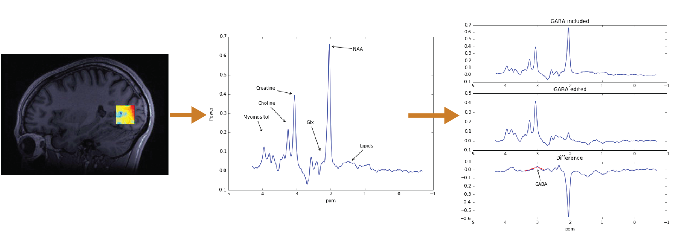

.. _smal:

Stanford CNI MRS Analysis Library (SMAL)
---------------------------------

`SMAL <http://cni.github.io/MRS>`_ provides algorithms and methods to analyze
data from experiments using Magnetic Resonance Spectroscopy. These data can be
used to make inferences about the chemical content of the human brain *in
vivo*. Below is an analysis aimed at quantifying the relative concentration of
the neurotransmitter GABA:

