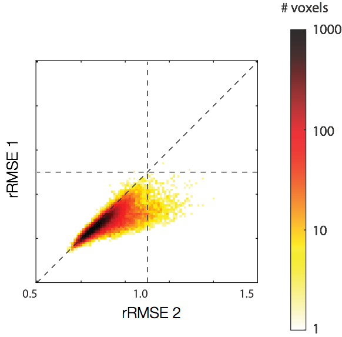

.. _osmosis:

Osmosis: in-vivo validation of diffusion MRI models
------------------------------------------

One of the major challenges in MRI is evaluation and validation of the inferences 
made from the measurement about brain structure and function. `Osmosis`__ is a
software library that performs evaluation and validation of models of diffusion
data, relative to test-retest reliability.

__ osmosis_

The software is intentionally written to be flexible and allow for others to
use to test new models and new ideas. We have also made a data-set with
test-retest reliability `available`__, to serve as a bench-mark

__ stanforddwi_

.. include:: links.txt

