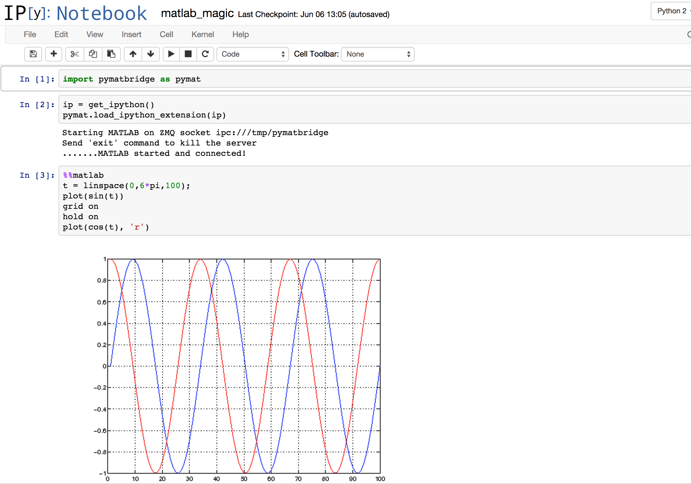

.. _pymatbridge:

The Python <=> MATLAB bridge 
----------------------------

Originally created by `Max Jaderberg <http://www.maxjaderberg.com/>`_,
`pymatbridge <http://arokem.github.io/python-matlab-bridge/>`_ aims to enable
communication between code that runs on Matlab (TM) and python code. In
addition, we have developed a `Matlab magic` for use with
`the IPython notebook <http://ipython.org/notebook>`_.

Here's what that might look like:

